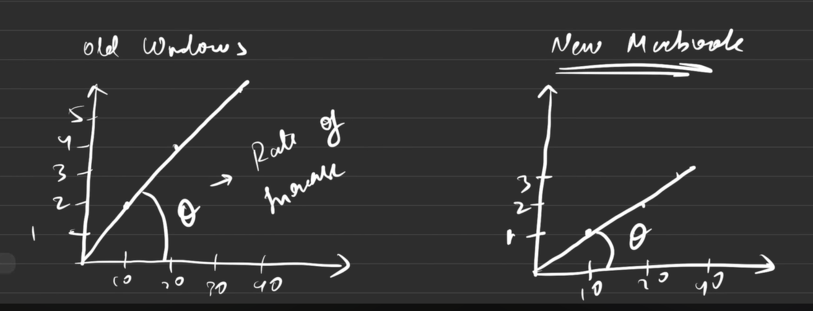

# Why and what is Time Complaxity?

 + TC != time taken
 + the time taken is diffrent on diffrent systems/confugretion
 + the rate in increses with respect to the input size = TC
 + or how the number of opretions are changing with the change in input
 + TC or O never changes for a given code on any machine

 

## Big-O Notation -> O(n)

Here 'n' is the total number of opretions

```C
for(int i = 0; i<= 5; i++){
    printf("hello")
}
```
+ *the total ops for this code = (no. of ops in the loop) X (no. of times the loop runs)*

+ Rules of big-O(n)
    + TC to be calculated in terms of worst case scenario
    + avoid constants(no. of ops in single itretion)
    + avoid lowwer values


# Space Complexity -> memory space

it is = Auxiliary space(space taken to solve the problem) + Input space(space to store the input)
    
